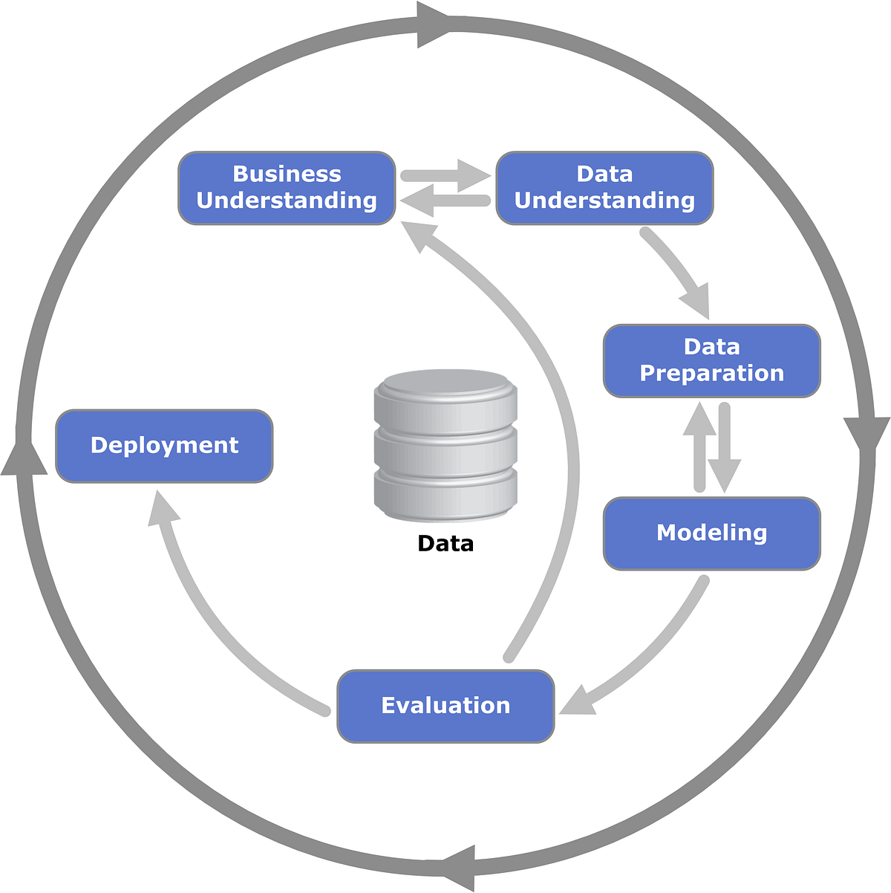

<!-- _class: lead -->

<style scoped>
.logo-bar { position: absolute; top: 36px; right: 64px; display: flex; align-items: center; gap: 16px; }
.logo-bar img { width: 100px; height: 100px; object-fit: contain; }
</style>

<div class="logo-bar">
  
  
</div>

# Intermediate Machine Learning

<div class="subtitle">Model Selection and Evaluation (Morning Session)</div>


คณะวิศวกรรมศาสตร์ · มหาวิทยาลัยมหิดล

ผู้สอน: **ผศ.ดร. ทวีศักดิ์ สมานชื่น**

---

## วัตถุประสงค์การเรียนรู้

เมื่อจบภาคเช้านี้ นักศึกษาสามารถ:

1. **แยกประเภทปัญหา** Supervised และ Unsupervised Learning ได้อย่างถูกต้อง
2. **สร้าง baseline และโมเดลหลัก** สำหรับงาน classification บนข้อมูลจริง
3. **เลือกใช้ metric และ cross-validation** ที่เหมาะกับโจทย์ธุรกิจ
4. **รับมือข้อมูลไม่สมดุลเบื้องต้น** ด้วย class weight และ threshold tuning
5. **สรุปเหตุผลการเลือกโมเดล** ในรูปแบบที่สื่อสารกับทีมได้

---

## แผนการสอน 3 ชั่วโมง (ภาคเช้า)

1. 00:00-00:15: Warm-up และ problem framing
2. 00:15-00:35: ทบทวน ML types
3. 00:35-01:00: Baseline model (Logistic Regression)
4. 01:00-01:30: Tree-based model (Random Forest)
5. 01:30-01:40: พัก
6. 01:40-02:05: Evaluation and model selection
7. 02:05-02:35: Imbalanced data mini-lab
8. 02:35-03:00: Workshop summary และสะท้อนผล

---

<!-- _class: divider -->

## Warm-up
## AI in Colab

Using AI to Start Faster, Not to Skip Thinking

---

## ทำไมเริ่มจาก Colab + AI

### เป้าหมายของ warm-up

- ให้ผู้เรียนเปิด notebook ได้เร็วและไม่ติดตั้งเครื่องมือเยอะ
- ใช้ AI ช่วยอธิบายโค้ดและสร้าง baseline ได้เร็วขึ้น
- สอนวิธีถาม AI อย่างมีโครงสร้าง ไม่ใช่แค่ copy-paste คำตอบ

### แนวคิดสำคัญ

- AI เป็นผู้ช่วย ไม่ใช่ตัวแทนการคิด
- ผู้เรียนต้องอ่านผลลัพธ์และตรวจความถูกต้องเสมอ

---
## 1. การใช้ AI ผ่าน comment 


- ใช้การเขียน comment ใน code cell เพื่อให้ AI ช่วย generate code หรืออธิบายโค้ด
```python
# plot sin wave from 0 to 2pi
import numpy as np
import matplotlib.pyplot as plt
x = np.linspace(0, 2*np.pi, 100)
y = np.sin(x)
plt.plot(x, y)
```
- AI จะร่างโค้ดตาม comment ให้โดยอัตโนมัติ

- เหมาะกับผู้เรียนที่มีประสบการณ์เขียนโค้ดบ้างแล้ว 

 
---
## 2. การใช้ AI ผ่าน sidebar 

 - ถามคำถามเชิงแนวคิดหรือขอคำแนะนำได้ เพื่อพูดคุยตอบคำถามต่าง ๆ เช่น 
"ทำไมต้องใช้ cross-validation แทนการแบ่งข้อมูลแบบ train/test เพียงครั้งเดียว?"

- ให้ AI ช่วยเขียน code ได้เช่นกัน โดยการพิมพ์คำขอใน sidebar เช่น
"ช่วยเขียนโค้ด Python ใน Colab เพื่อสร้าง Random Forest model และประเมินผลด้วย F1-score โดยใช้ scikit-learn พร้อมอธิบายแต่ละขั้นตอนสั้นๆ"

- ผู้เรียนสามารถระบุตำแหน่ง cell_id ที่ต้องการให้ AI ช่วยเขียนโค้ดได้ด้วยการเลือก cell นั้นก่อนถามใน sidebar โดยสามารถขอดู cell_id ได้จากการให้  AI ช่วย list cell ใน notebook เช่น
"ช่วย list cell ใน notebook พร้อม cell_id เพื่อให้ฉันเลือกตำแหน่งที่ต้องการให้ช่วยเขียนโค้ด"

- กรณีที่เป็น cell ใหม่สามารถกดเลือกตรงตำแหน่ง generate with AI ได้เลย แล้วพิมพ์คำขอใน sidebar เพื่อให้ AI ช่วยเขียนโค้ดใน cell นั้นได้ทันที
---

## Workflow แบบง่ายใน Colab

### Step-by-step

1. เปิด Colab notebook
2. Upload dataset หรือ mount Google Drive
3. ใช้ AI ช่วยสรุป dataframe และทำ preprocessing เบื้องต้น
4. สร้าง baseline model
5. ให้ AI ช่วยอธิบาย metric และผลลัพธ์

### สิ่งที่ต้องเน้นกับผู้เรียน

- ตรวจชื่อคอลัมน์และชนิดข้อมูลก่อนรันโค้ด
- อย่าเชื่อ output ของ AI โดยไม่ลองรันจริง

---

## ตัวอย่างการถาม AI ใน Colab

### Prompt pattern ที่แนะนำ

> ช่วยเขียนโค้ด Python ใน Colab เพื่อโหลด dataset churn, ตรวจ missing values, และสร้าง Logistic Regression baseline โดยใช้ scikit-learn พร้อมอธิบายแต่ละขั้นตอนสั้นๆ

<div class="columns">
<div>

### Prompt ที่ควรเลี่ยง

- "เขียนโค้ดทั้งหมดให้เลย"
- "เอาคำตอบที่ดีที่สุด"
- "ไม่ต้องอธิบาย แค่ให้ผลลัพธ์"
</div>
<div>

### หลักคิด

- ถามแบบระบุ input, output, และข้อจำกัดให้ชัด
- ขอคำอธิบายสั้นๆ คู่กับโค้ดเสมอ
</div>
</div>


---

<!-- _class: divider -->

## 01
## Problem Framing and ML Types

Supervised vs Unsupervised in Practice

---
## โจทย์หลักของคาบนี้

<div class="columns">
<div>

### Use Case

**Customer Churn Prediction**

- อินพุต: พฤติกรรมลูกค้า, ประวัติการใช้งาน, แพ็กเกจ
- เอาต์พุต: ลูกค้าจะ churn หรือไม่ (Yes/No)
- ประเภทปัญหา: **Supervised Classification**
- Kaggle: [Telco Customer Churn](https://www.kaggle.com/blastchar/telco-customer-churn)

</div>
<div>

### Why this use case?

- เชื่อมกับการตัดสินใจเชิงธุรกิจได้ชัด
- ใช้สาธิต metrics ได้หลากหลาย
- เหมาะกับการสาธิตปัญหา class imbalance

### ข้อมูลสำคัญ

- จำนวนตัวอย่างประมาณ **7,043 customers**
- Target: **Churn** (Yes/No)
- ฟีเจอร์ที่ใช้บ่อย: `tenure`, `MonthlyCharges`, `Contract`, `PaymentMethod`, `InternetService`
</div>
</div>

---

## Dataset: IBM Telco Customer Churn

### ข้อมูลชุดนี้เหมาะกับคาบนี้อย่างไร

- เป็นโจทย์ **binary classification** ที่ตรงกับ churn prediction
- มีทั้งตัวแปรเชิงตัวเลขและตัวแปรเชิงหมวดหมู่ เหมาะกับการสาธิต preprocessing
- มี class imbalance ให้ฝึกคิดเรื่อง precision, recall และ threshold tuning


---
## Dataset: IBM Telco Customer Churn

| ฟิลด์ | ชนิด | ตัวอย่างค่า | ความหมาย |
|---|---|---|---|
| `customerID` | text | `7590-VHVEG` | รหัสลูกค้า |
| `gender` | text | `Female` | เพศ |
| `SeniorCitizen` | numeric | `0` | อายุ 60 ปีขึ้นไป (0=ไม่ใช่, 1=ใช่) |
| `tenure` | numeric | `12` | อายุการเป็นลูกค้า (เดือน) |
| `Contract` | text | `Month-to-month` | ประเภทสัญญา |
| `MonthlyCharges` | numeric | `70.35` | ค่าบริการรายเดือน |
| `TotalCharges` | text/numeric | `845.5` | ยอดชำระสะสม |
| `Churn` | text | `Yes` | ลูกค้ายกเลิกบริการหรือไม่ |

Dataset Link: <a href="https://raw.githubusercontent.com/IBM/telco-customer-churn-on-icp4d/master/data/Telco-Customer-Churn.csv"><u>Telco Customer Churn</u></a>


---
## 1) Business Understanding (Telco)

<div class="columns">
<div>

### โจทย์ธุรกิจ
- บริษัทต้องการลด churn เพื่อลดต้นทุนการหาลูกค้าใหม่และรักษารายได้ระยะยาว
- เป้าหมายเชิงธุรกิจ: ลด churn rate ลงอย่างน้อย 2-3% ในไตรมาสถัดไป
- KPI ที่ควรติดตาม: churn rate, retention rate, รายได้ที่เสี่ยงสูญเสีย

### คำถามเชิงธุรกิจที่แปลงเป็นคำถามข้อมูล

> ลูกค้ากลุ่มไหนมีแนวโน้มยกเลิกบริการสูง และควรออกมาตรการรักษาลูกค้าอย่างไร?

</div>
<div class="center">



</div>
</div>

---
## 2) Data Understanding (Telco)

### ตัวแปรสำคัญที่ต้องเข้าใจก่อนวิเคราะห์
- Target: `Churn` (Yes/No)
- Customer profile: `gender`, `SeniorCitizen`, `Partner`, `Dependents`
- Account info: `tenure`, `Contract`, `PaperlessBilling`, `PaymentMethod`
- Service usage: `InternetService`, `OnlineSecurity`, `TechSupport`, `StreamingTV`
- Revenue drivers: `MonthlyCharges`, `TotalCharges`

### คำถามข้อมูลหลัก
1. สัญญาแบบใด churn สูงสุด
2. tenure ที่สั้นสัมพันธ์กับ churn หรือไม่
3. ลูกค้าที่ค่าบริการสูง churn มากขึ้นหรือไม่
4. บริการเสริมใดช่วยลด churn

---
## 3) Data Quality Checklist (Telco)

ก่อนวิเคราะห์ ต้องตรวจ 5 จุดนี้ให้ครบ

1. Missing values: โดยเฉพาะ `TotalCharges` ที่มักเป็นค่าว่างในบางแถว
2. Data type: แปลง `TotalCharges` เป็น numeric และตรวจค่าที่ parse ไม่ได้
3. Duplicate: ตรวจ `customerID` ซ้ำ
4. Category consistency: ตรวจรูปแบบค่า `Yes/No`, `No internet service`, `No phone service`
5. Class balance: ตรวจสัดส่วน `Churn=Yes` เทียบ `No` เพื่อวางแผนการตีความผล

---
## 4) Hands-on Colab: Business -> Data Understanding

### Workshop Goal
- สรุป churn rate ภาพรวม
- ตรวจคุณภาพข้อมูลเบื้องต้น
- สร้าง insight แรกเพื่อคุยกับ stakeholder

```prompt
ช่วยเขียนโค้ด Python ใน Colab เพื่อ:
1) โหลด IBM Telco Customer Churn จากไฟล์ CSV
2) แสดงขนาดข้อมูล, ชนิดข้อมูล, missing values
3) แปลง TotalCharges เป็นตัวเลขและรายงานจำนวนแถวที่แปลงไม่ได้
4) สรุป churn rate รวม และ churn rate แยกตาม Contract
5) วาดกราฟ bar chart เปรียบเทียบ churn rate ตาม Contract
พร้อมอธิบายโค้ดทีละขั้นตอน
```

 
---
## Data Preparation Checklist

รายการตรวจสอบและจัดการข้อมูลเบื้องต้นที่ควรทำก่อนวิเคราะห์
1. ตรวจสอบ missing values และค่าผิดรูปแบบ
2. ตรวจสอบความซ้ำซ้อนของรายการข้อมูล
3. ตรวจสอบความสอดคล้องของหน่วยและรหัสข้อมูล
4. ตรวจสอบ outliers และจัดการตามความเหมาะสม
5. แปลงชนิดข้อมูลให้เหมาะสม
6. สร้างคอลัมน์ใหม่เพื่อการวิเคราะห์
---

## ทบทวนประเภทของ Machine Learning

<div class="columns">

### Supervised Learning

- มีป้ายกำกับ (label) ให้เรียนรู้
- ตัวอย่าง: Churn prediction, Fraud detection
- โฟกัสคาบนี้: **Classification models**

### Unsupervised Learning

- ไม่มีป้ายกำกับ
- ตัวอย่าง: Customer segmentation, anomaly exploration
- อยู่ในสไลด์เสริมช่วงท้าย (ไม่ลงมือทำในคาบ)

</div>

> หลักคิดสำคัญ: เริ่มจากโจทย์ธุรกิจก่อนเลือกวิธี ML เสมอ

---

<!-- _class: divider -->

## 02
## Baseline and Main Models

From Simple to Strong Models

---

## Model 1: Baseline ด้วย Logistic Regression

### เหตุผลที่ต้องเริ่มจาก baseline

- เทรนเร็วและอธิบายง่าย
- เป็นจุดอ้างอิงก่อนขยับไปโมเดลที่ซับซ้อน
- ช่วยเห็นว่าการเพิ่มความซับซ้อนคุ้มค่าหรือไม่

### สมการ (แนวคิด)

$$
P(y=1\mid x)=\sigma(w^Tx+b)
$$

โดยที่ $\sigma(z)=\frac{1}{1+e^{-z}}$

---

## Logistic Regression: หลักคิดเชิงทฤษฎี

### เรา optimize อะไร?

- ใช้หลัก **Maximum Likelihood Estimation (MLE)**
- เทียบเท่ากับการ minimize **log loss (cross-entropy)**

$$
\mathcal{L} = -\frac{1}{n}\sum_{i=1}^{n}\left[y_i\log\hat{p}_i + (1-y_i)\log(1-\hat{p}_i)\right]
$$

### ทำไมเหมาะเป็น baseline

- coefficient ตีความได้ผ่าน odds ratio
- แยกเส้นแบ่งเชิงเส้นได้ชัดเจน
- เป็นจุดเริ่มที่ดีสำหรับการตรวจ data leakage และ quality ของ feature

---

## Logistic Regression in sklearn


```python
from sklearn.pipeline import Pipeline
from sklearn.preprocessing import StandardScaler
from sklearn.linear_model import LogisticRegression

lr_pipe = Pipeline([
  ("scaler", StandardScaler()),
  ("model", LogisticRegression(
    max_iter=1000,
    class_weight="balanced",
    solver="liblinear"
  ))
])
```

---

## Logistic Regression in sklearn (ต่อ)

### หลักคิดพารามิเตอร์

- `class_weight='balanced'`: ช่วยเมื่อคลาสไม่สมดุล
- `max_iter`: กัน model ไม่ converge
- `solver`: เลือกตามขนาดข้อมูลและรูปแบบ regularization


>**class_weight vs smote**: class_weight ใช้ปรับน้ำหนักใน loss function ขณะที่ smote ใช้สร้างตัวอย่างใหม่เพื่อ balance dataset มีข้อดีข้อเสียต่างกัน ขึ้นกับขนาดข้อมูลและความซับซ้อนของปัญหา เมื่อข้อมูล imbalance ไม่มาก  class_weight อาจเพียงพอ แต่ถ้า imbalance สูงมาก smote อาจช่วยได้มากกว่า ต้องทดลองและประเมินผลด้วย metric ที่เหมาะสม เช่น F1-score หรือ ROC-AUC เพื่อเลือกวิธีที่ดีที่สุดสำหรับโจทย์นั้น ๆ

---

## Model 2: Random Forest (Main Model)

### แนวคิด

- รวมผลจากหลาย decision trees (ensemble)
- แต่ละต้นเรียนรู้จากข้อมูลย่อยที่สุ่ม
- สรุปผลด้วย voting เพื่อลด variance

### จุดเด่นในงาน tabular

- จับความสัมพันธ์ไม่เชิงเส้น (non-linear) ได้ดี
- ไม่ต้อง feature scaling มากเท่า linear models
- มักให้ผลแข็งแรงโดยไม่ต้อง tuning มาก

---

## Random Forest: หลักคิดเชิงทฤษฎี

### กลไกสำคัญ

1. **Bootstrap sampling**: แต่ละต้นเรียนจากชุดข้อมูลสุ่มแบบใส่คืน 
2. **Feature randomness**: แต่ละ split ใช้แค่บาง feature
3. **Aggregation**: รวมผลทำนายจากหลายต้น (majority vote)

### มุมมอง Bias-Variance

- Decision tree เดี่ยว: variance สูง
- Random Forest: ลด variance ด้วยการเฉลี่ยหลายต้น
- ผลคือ generalize ดีขึ้นในข้อมูล tabular ส่วนใหญ่

---

## Random Forest in sklearn

```python
from sklearn.ensemble import RandomForestClassifier

rf = RandomForestClassifier(
  n_estimators=300,
  max_depth=None,
  min_samples_leaf=2,
  max_features="sqrt",
  class_weight="balanced_subsample",
  random_state=42,
  n_jobs=-1
)
```

---

## Random Forest in sklearn (ต่อ)

### หลักคิดพารามิเตอร์

- `n_estimators`: เพิ่มความเสถียร แต่ใช้เวลามากขึ้น
- `max_depth`, `min_samples_leaf`: คุมความซับซ้อนและลด overfitting
- `max_features='sqrt'`: ลดความสัมพันธ์กันของต้นไม้
- `class_weight='balanced_subsample'`: ช่วยจัดการ imbalance ในแต่ละ bootstrap

---

## จากทฤษฎีสู่การใช้งานจริง: เปรียบเทียบให้เป็น

### ทำไมต้องเทียบ Logistic vs Random Forest

- Logistic: ตีความง่าย, เป็น baseline ที่โปร่งใส
- Random Forest: performance ดีใน pattern ซับซ้อน
- ทั้งสองโมเดลตอบคำถามคนละมุม: **ความเข้าใจ vs ประสิทธิภาพ**

### แนวทางสอนในคาบ

1. ฝึกตั้ง baseline ก่อน
2. เพิ่ม model complexity อย่างมีเหตุผล
3. ตัดสินด้วย CV + metric ที่สอดคล้องต้นทุนธุรกิจ

---

## Model 3: XGBoost (Advanced Ensemble)

### แนวคิดหลัก: Gradient Boosting

- Sequential ensemble: แต่ละต้นเรียนรู้จาก **residual** ของต้นก่อนหน้า
- เทียบ Random Forest: ต้นไม้เสร็จพร้อมแล้ว → XGBoost ค่อย ๆ ปรับปรุง

$$
\hat{y}_i^{(t)} = \hat{y}_i^{(t-1)} + \eta f_t(x_i)
$$

โดยที่ $f_t$ คือต้นไม้ที่ $t$ และ $\eta$ คือ learning rate

### ข้อดี

- Performance สูงขึ้นในหลายๆ dataset
- Feature importance ให้ผลที่เชื่อถือได้บ้าง

---

## Regularization: แนวคิดพื้นฐาน

### ทำไมต้องมี Regularization

- **Overfitting**: โมเดลเรียนรู้ noise แทนที่จะเรียนรู้ pattern จริง
- **Bias-variance tradeoff**: ให้น้ำหนักมากแก่ training data → variance สูง

### วิธีแก้ไข

เพิ่ม penalty term เข้าไปใน objective function:

$$
\text{Total Loss} = \text{Training Loss} + \text{Regularization Penalty}
$$

- ลดโอกาสโมเดลเชื่ออย่างไม่สมควรในรายละเอียด
- บังคับให้โมเดล "ง่าย" และ generalize ได้ดี

---

## L2 (Ridge) vs L1 (Lasso) Regularization

| ประเภท | สูตร | ผลกระทบ | ใช้เมื่อ |
|---|---|---|---|
| **L2 (Ridge)** | $\lambda \sum w_j^2$ | Shrink weights ค่อยเป็นค่อยไป | Features สัมพันธ์กันสูง |
| **L1 (Lasso)** | $\lambda \sum \|w_j\|$ | บาง weights เป็น 0 (feature selection) | ต้องการตีความ, feature มาก |
| **Elastic Net** | $\lambda_1 \sum w_j^2 + \lambda_2 \sum \|w_j\|$ | ผสมข้อดีของ L1 + L2 | ต้องการ balance |

### ภาพเปรียบเทียบ

- **ไม่มี regularization**: โมเดลเลือกค่า weight ใหญ่ๆ เพื่อ fit training data
- **L2**: ผลักดัน weight ให้เล็กกำลังพอ
- **L1**: บางส่วน weight ถูกบังคับเป็น 0 → feature selection

---

## Regularization ในบริบท Tree-based Models

### Tree complexity penalty

- **Depth**: ต้นไม้ลึก → overfitting
- **Number of leaves**: ใบมากๆ → pattern ซับซ้อนเกินไป
- **Leaf weights**: ค่าที่ใบใหญ่ → ความเสี่ยง overfitting

### XGBoost เพิ่ม regularization ทั้งสองมิติ

1. จำกัดโครงสร้าง (จำนวนใบ)
2. จำกัดค่า (leaf weights)

→ ทำให้ได้โมเดลที่ balanced ระหว่าง accuracy และ generalization

---

## XGBoost: หลักคิดเชิงทฤษฎี (ต่อ)

### Regularization ที่ XGBoost มี

$$
\text{Objective} = \sum_{i=1}^{n}L(y_i, \hat{y}_i) + \sum_{t=1}^{T}\Omega(f_t)
$$

$L$ คือ training loss (เช่น log loss) และ $\Omega$ คือ regularization term โดยที่ $\Omega(f) = \gamma T + \frac{\lambda}{2}\sum_{j=1}^{T}w_j^2$

- $T$: จำนวนใบในต้น (ลงโทษต้นไม้ที่ซับซ้อน)
- $w_j$: น้ำหนักที่ใบ (ลงโทษค่าที่สูงมากเกินไป)

### ทำไมสำคัญ

- ป้องกัน overfitting แม้ว่าเทรนจำนวนต้นเยอะ

---

## XGBoost in sklearn

```python
from xgboost import XGBClassifier
xgb = XGBClassifier(
    n_estimators=300, max_depth=6,
    learning_rate=0.1, subsample=0.8,
    colsample_bytree=0.8, reg_lambda=1.0,
    reg_alpha=0.0, scale_pos_weight=2.5,
    random_state=42, n_jobs=-1,
    verbosity=0
)
```

---

## XGBoost in sklearn (ต่อ)

### หลักคิดพารามิเตอร์

- `learning_rate`: ขนาดก้าว ค่าต่ำ = เทรนช้าแต่แม่นกว่า
- `subsample`: ใช้ข้อมูลเท่าไร (0.8 = 80%)
- `colsample_bytree`: ใช้ feature เท่าไร
- `reg_lambda`, `reg_alpha`: L2 และ L1 regularization

---

## Model 4: LightGBM (Faster Gradient Boosting)

### ความแตกต่างจาก XGBoost

1. **Leaf-wise growth**: เลือก split ที่ลด loss มากที่สุด ไม่ใช่ทีละชั้น
2. **GOSS** (Gradient-based One-Side Sampling): ใช้แค่ instance ที่มี gradient สูง
3. **Bundle Features**: บีบอัดข้อมูลความสัมพันธ์ระหว่าง feature

### ข้อดี

- เทรนเร็วกว่า XGBoost มาก (บ่อยครั้ง 5-10x)
- ใช้หน่วยความจำน้อยลง
- เหมาะกับข้อมูลใหญ่

---

## LightGBM: หลักคิดเชิงทฤษฎี

### Leaf-wise vs Level-wise

- **Level-wise** (XGBoost): ปรับ leaf ทีละชั้น
- **Leaf-wise** (LightGBM): เลือก leaf ที่ลด loss มากที่สุด → อาจได้โมเดลที่แม่นกว่า แต่ต้องระวัง overfitting


### GOSS

- เก็บ instance ที่มี gradient สูง (ช่วย training มาก)
- ทิ้ง instance ที่มี gradient ต่ำ (redundant)
- ลด data ได้ 50-70% แต่ยังเก็บ signal ที่ดี

---

## LightGBM in sklearn

```python
from lightgbm import LGBMClassifier

lgb = LGBMClassifier(
    n_estimators=300, max_depth=7,
    learning_rate=0.1, num_leaves=31,
    subsample=0.8, colsample_bytree=0.8,
    reg_lambda=1.0, class_weight='balanced',
    random_state=42, n_jobs=-1,
    verbose=-1
)
```

---

## LightGBM in sklearn (ต่อ)

### หลักคิดพารามิเตอร์

- `num_leaves`: ควบคุมความซับซ้อน (บ่อย 20-40)
- `max_depth`: ข้อจำกัดความลึก (prevent overfitting)
- `subsample`: fraction ของข้อมูลต่อรอบ
- `learning_rate`: ดูข้างบน

---

## สรุปโมเดลที่ใช้สอนจริงในภาคเช้า

| Model | บทบาท | จุดเด่น | สิ่งที่ต้องระวัง |
|---|---|---|---|
| Logistic Regression | Baseline | ตีความง่าย, เร็ว | จำกัดความสัมพันธ์เชิงเส้น |
| Random Forest | Main model | จับ non-linear ได้ดี | อธิบายรายจุดยากขึ้น |
| XGBoost | Advanced | Performance สูง | overfitting เร็ว, tuning ซับซ้อน |
| LightGBM | Advanced fast | เร็วกว่า XGBoost | ต้องระวัง overfitting |

---

## เลือกโมเดลตามความต้องการของการใช้งาน

<div class="columns">
<div >
 
### ถ้าเวลามี 3 ชั่วโมง (Classic workflow)

- Focus: Logistic Regression + Random Forest
- XGBoost/LightGBM: แนะนำเป็นเนื้อหาเพิ่มเติมหลังคาบ

### ถ้าเวลามี 4-5 ชั่วโมง (Extended workflow)

- เพิ่มสอน XGBoost หรือ LightGBM
- เทียบ 3-4 โมเดลและตัดสินใจด้วย CV metrics
- Demo ว่า boosting เร็วกว่า Random Forest เท่าไร

</div>
<div>

### หลักเลือกในการใช้งานจริง

1. **Small/medium data** & ต้องตีความ → Logistic Regression
2. **Small/medium data** & ต้องการความแม่นยำที่ดีโดย tuning ไม่มาก → Random Forest
3. **Medium data** & ต้อง high performance → XGBoost
4. **Large data** & ต้องเร็ว → LightGBM

</div>
</div>

---

<!-- _class: divider -->

## 03
## Evaluation and Model Selection

Choose Metrics that Match the Goal

---

## Data Splitting and Cross-validation

### หลักการแบ่งข้อมูล

- Train set: เรียนรู้พารามิเตอร์
- Validation (หรือ CV): เลือกโมเดล/จูน
- Test set: ประเมินผลสุดท้าย

### k-fold Cross-validation

- แบ่งข้อมูลเป็น $k$ ส่วน
- เทรน $k$ รอบและสลับ validation fold
- สรุปผลด้วยค่าเฉลี่ยและส่วนเบี่ยงเบนมาตรฐาน

---

## เลือก Evaluation Metrics อย่างไร

| Metric | เหมาะเมื่อ | หมายเหตุ |
|---|---|---|
| Accuracy | คลาสสมดุล | อาจหลอกได้เมื่อข้อมูลไม่สมดุล |
| Precision | FP แพง | เน้นทำนาย positive ให้แม่น |
| Recall | FN แพง | เน้นจับ positive ให้ครบ |
| F1-score | ต้อง balance P/R | นิยมใช้ในงาน imbalanced |
| ROC-AUC | เทียบความสามารถแยกคลาส | ดูแนวโน้มโดยรวมของ threshold |

---

## นิยามก่อนดูสูตร (Confusion Matrix)

ให้กำหนดก่อนว่า class ที่สนใจคือ **Positive**

- **TP (True Positive):** ทำนายว่า Positive และจริง ๆ เป็น Positive
- **TN (True Negative):** ทำนายว่า Negative และจริง ๆ เป็น Negative
- **FP (False Positive):** ทำนายว่า Positive แต่จริง ๆ เป็น Negative
- **FN (False Negative):** ทำนายว่า Negative แต่จริง ๆ เป็น Positive

> สูตรของหลาย metric จะคำนวณจาก 4 ค่านี้โดยตรง

---

## สูตรของแต่ละ Evaluation Metric

### 1) Accuracy

$$
\mathrm{Accuracy} = \frac{TP + TN}{TP + TN + FP + FN}
$$

วัดสัดส่วนที่ทายถูกทั้งหมด เหมาะเมื่อข้อมูลค่อนข้างสมดุล

### 2) Precision

$$
\mathrm{Precision} = \frac{TP}{TP + FP}
$$

ในสิ่งที่โมเดลทำนายว่า Positive มีที่ถูกจริงกี่ส่วน (เหมาะเมื่อ FP แพง)

---
## Evaluation Metrics (ต่อ)

### 3) Recall (Sensitivity)

$$
\mathrm{Recall} = \frac{TP}{TP + FN}
$$

จาก Positive จริงทั้งหมด โมเดลจับได้กี่ส่วน (เหมาะเมื่อ FN แพง)

### 4) F1-score

$$
\mathrm{F1} = 2\cdot\frac{\mathrm{Precision}\cdot\mathrm{Recall}}{\mathrm{Precision}+\mathrm{Recall}}
$$

ค่าเฉลี่ยแบบ harmonic ของ Precision และ Recall ใช้เมื่ออยาก balance ทั้งสองด้าน


---
## Evaluation Metrics (ต่อ)

### 5) ROC-AUC

- ROC curve วาดความสัมพันธ์ระหว่าง $TPR$ และ $FPR$ เมื่อเลื่อน threshold

$$
TPR = \frac{TP}{TP+FN},\qquad FPR = \frac{FP}{FP+TN}
$$

- **AUC** คือพื้นที่ใต้เส้น ROC; ยิ่งใกล้ 1 ยิ่งแยกคลาสได้ดี

---

## Imbalanced Data: สิ่งที่ต้องทำในคาบนี้

### วิธีพื้นฐานที่ใช้งานได้จริง

1. ใช้ `class_weight='balanced'`
2. ปรับ threshold จากค่า default 0.5
3. เปรียบเทียบผลผ่าน Precision, Recall, F1

### ข้อความที่ต้องสื่อให้ผู้เรียน

- ไม่มี threshold ที่ดีที่สุดแบบสากล
- ต้องตั้งตามต้นทุนของ FN/FP ในโจทย์จริง

---

<!-- _class: divider -->

## 04
## Workshop (Hands-on)

Build, Compare, and Justify

---

## Workshop Flow (45-50 นาที)

### Task sequence

1. Train Logistic Regression baseline
2. Train Random Forest
3. ทำ 5-fold cross-validation เปรียบเทียบ
4. จัดการ imbalance ด้วย class weight
5. ทดลองปรับ threshold และสรุป trade-off

### Deliverable ต่อกลุ่ม

- ตารางสรุป metrics
- โมเดลที่เลือก + เหตุผลเชิงธุรกิจ 3-4 บรรทัด

---

## Dataset: Bank Marketing Campaign (binary classification)

Link for dataset download:
- [Bank Marketing Dataset on UCI](https://archive.ics.uci.edu/ml/datasets/bank+marketing)

คำอธิบาย dataset:
- ข้อมูลเกี่ยวกับแคมเปญการตลาดทางโทรศัพท์ของธนาคาร
- Target: `y` (yes/no) ว่าลูกค้าตอบรับหรือไม่
- มีทั้งตัวแปรเชิงตัวเลขและเชิงหมวดหมู่ เหมาะกับการสาธิต preprocessing และ model evaluation
- มี class imbalance (ประมาณ 11% positive) ให้ฝึกคิดเรื่อง precision, recall และ threshold tuning
   
 
---
## ตัวอย่าง Report Outline 

1. ที่มาและเป้าหมายของโจทย์
2. คำอธิบาย Dataset
3. ขั้นตอนการเตรียมข้อมูลและ Feature Engineering
4. โมเดลที่เลือกใช้และเหตุผล
5. วิธีการประเมินโมเดลและ Metrics ที่ใช้
6. ตารางเปรียบเทียบผลลัพธ์ของโมเดล
7. เหตุผลในการเลือกโมเดลสุดท้าย
8. ข้อจำกัดและข้อเสนอแนะสำหรับการพัฒนาต่อ


---

## ตัวอย่าง Model Card 

| หัวข้อ | สิ่งที่ต้องส่ง |
|---|---|
| Problem | Churn prediction และ business impact |
| Candidate models | Logistic Regression, Random Forest |
| Main metric | F1-score หรือ Recall (ตามโจทย์) |
| Validation | 5-fold CV + test set |
| Decision | โมเดลที่เลือกและเหตุผล |

---

## สรุปภาคเช้า

- เริ่มจาก problem framing แล้วเลือกวิธี ML ที่สอดคล้อง
- ตั้ง baseline ก่อนเสมอเพื่อให้การเทียบโมเดลมีความหมาย
- ใช้ cross-validation และ metric ที่เหมาะกับธุรกิจ
- จัดการ class imbalance ก่อนสรุปว่าโมเดลไหนดีที่สุด

---

<!-- _class: divider -->

## Appendix
## Supplemental Slides (Not Taught in Class)

เนื้อหาเสริมเพื่อความครอบคลุม Module 5-6

---

<!-- _class: highlight -->

## สไลด์เสริม: Unsupervised Learning

> หมายเหตุ: ส่วนนี้เป็นเนื้อหาอ่านเพิ่ม ไม่ใช่ภาคปฏิบัติหลักในคาบเช้า

### K-means

- จัดกลุ่มด้วย centroid
- ต้องกำหนดจำนวนคลัสเตอร์ล่วงหน้า
- เหมาะกับ segmentation ที่ตีความง่าย

### DBSCAN

- จัดกลุ่มจากความหนาแน่น
- รองรับคลัสเตอร์รูปร่างซับซ้อน
- แยก noise ได้ แต่ไวต่อการตั้งค่า `eps` และ `min_samples`

---

<!-- _class: highlight -->

## สไลด์เสริม: Dimensionality Reduction

> หมายเหตุ: ส่วนนี้เป็นเนื้อหาอ่านเพิ่ม ไม่ใช่ภาคปฏิบัติหลักในคาบเช้า

- **PCA**: ลดมิติแบบเชิงเส้นเพื่อเก็บความแปรปรวนหลัก
- **t-SNE**: visualization โครงสร้างใกล้กันในข้อมูลมิติสูง
- **UMAP**: visualization เร็ว และรักษาโครงสร้างภาพรวมได้ดีในหลายกรณี

ข้อควรจำ: t-SNE/UMAP เหมาะกับการสำรวจข้อมูล ไม่ใช่ metric ตัดสินโมเดลสุดท้าย

---

<!-- _class: highlight -->

## สไลด์เสริม: Regularization Methods

> หมายเหตุ: ส่วนนี้เป็นเนื้อหาอ่านเพิ่ม ไม่ใช่ภาคปฏิบัติหลักในคาบเช้า

- **Ridge (L2)**: ลด overfitting ด้วยการ shrink coefficients
- **Lasso (L1)**: บาง coefficient เป็นศูนย์ ช่วยคัดเลือก feature
- **Elastic Net**: ผสม L1 + L2 เหมาะเมื่อ feature สัมพันธ์กันสูง

---

<!-- _class: highlight -->

## สไลด์เสริม: Feature Engineering Workflow

> หมายเหตุ: ส่วนนี้เป็นเนื้อหาอ่านเพิ่ม ไม่ใช่ภาคปฏิบัติหลักในคาบเช้า

1. Data cleaning และ data quality checks
2. Encoding/Scaling ตามชนิดโมเดล
3. สร้าง feature ที่มีความหมายเชิงโดเมน
4. ใส่ขั้นตอนทั้งหมดใน pipeline เพื่อลด data leakage
5. ประเมินซ้ำด้วย CV หลังปรับ feature

---

## Recommended Reading After Class

1. ISLP (An Introduction to Statistical Learning with Python): Ch. 4, 8, 10
2. Hands-On Machine Learning (Géron): Ch. 6, 7
3. scikit-learn docs: Model Evaluation and Imbalanced Classification

---
## Example Colab 

- [Telco Churn Prediction Notebook](https://github.com/toche7/SlideAdvanceDSBDI/blob/main/notebook/TelCo_Customer_Churn.ipynb)
- [Bank Marketing Campaign Notebook](https://github.com/toche7/SlideAdvanceDSBDI/blob/main/notebook/BankMarketing.ipynb)

---

<!-- _class: lead -->

# Q&A

<div class="subtitle">Morning Session Complete</div>

**ผศ.ดร. ทวีศักดิ์ สมานชื่น**
taweesak.sam@mahidol.ac.th

คณะวิศวกรรมศาสตร์ · มหาวิทยาลัยมหิดล
