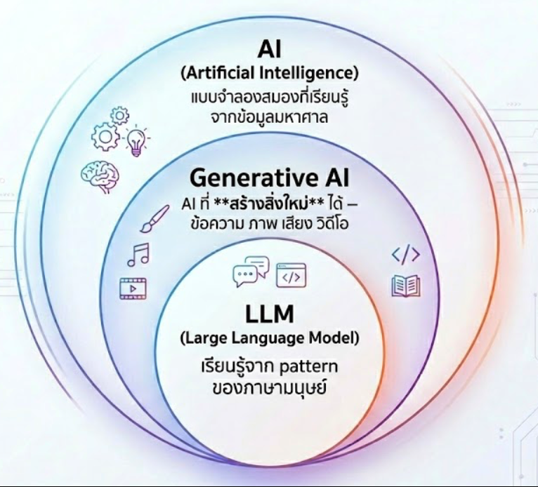
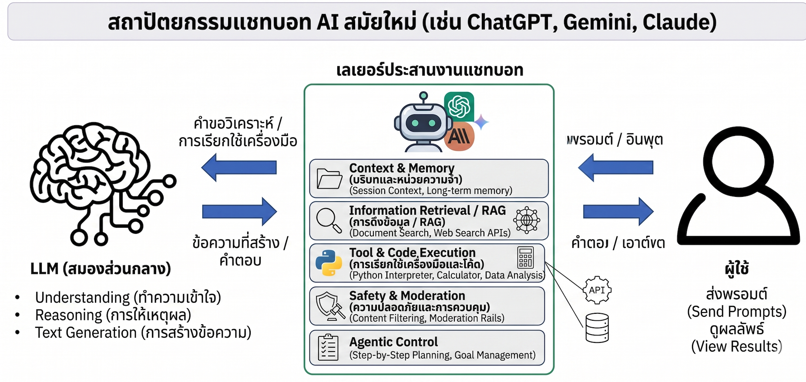
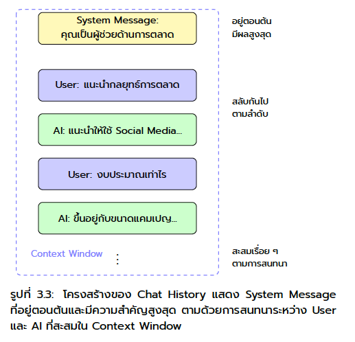
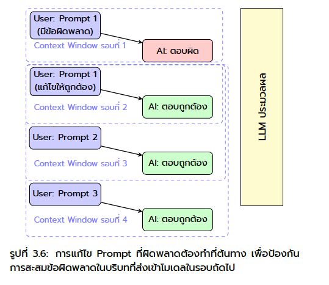
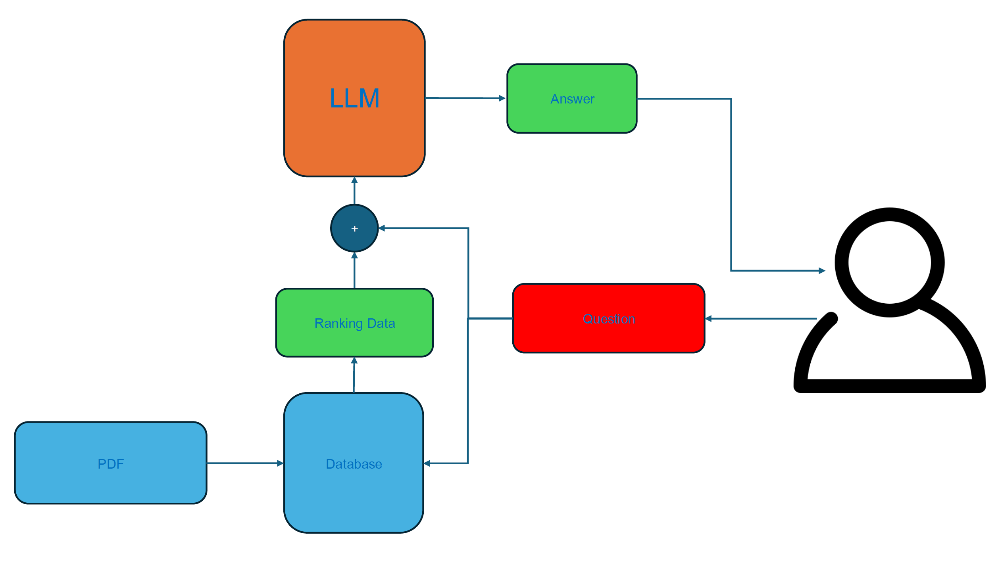
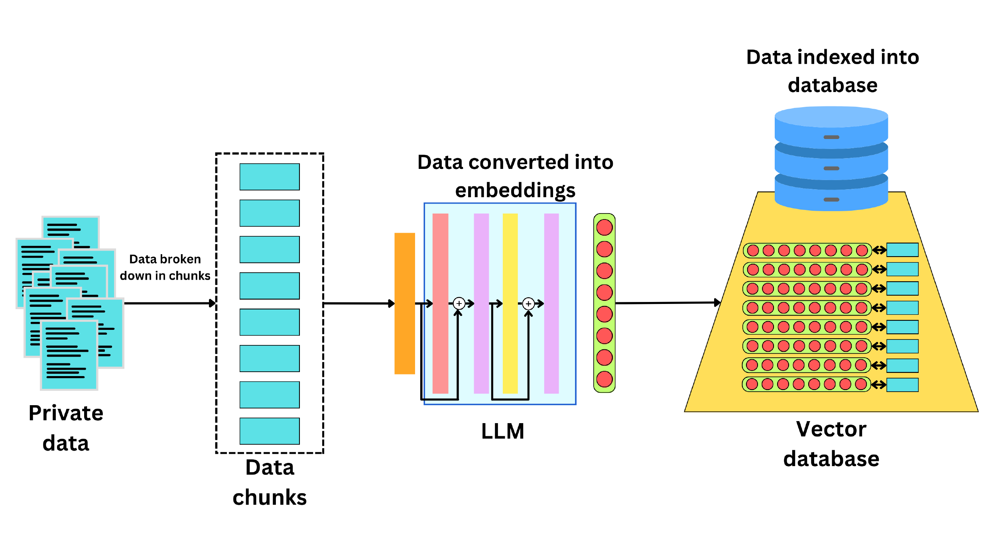

<!-- _class: lead -->

<style scoped>
.logo-bar { position: absolute; top: 36px; right: 64px; display: flex; align-items: center; gap: 16px; }
.logo-bar img { width: 100px; height: 100px; object-fit: contain; }
</style>

<div class="logo-bar">
  
  
</div>

# Generative AI for Data Work

<div class="subtitle">LLMs, SQL, EDA, Extraction, and Chatbot Workflow</div>
คณะวิศวกรรมศาสตร์ · มหาวิทยาลัยมหิดล

ผู้สอน: **ผศ.ดร. ทวีศักดิ์ สมานชื่น**

---

## วัตถุประสงค์การเรียนรู้

เมื่อจบภาคบ่ายนี้ นักศึกษาสามารถ:

1. **อธิบายบทบาทของ LLM** ในงาน Data Science ได้อย่างเป็นระบบ
2. **ใช้ LLM ช่วยสร้าง SQL และทำ EDA** ได้อย่างมีวิจารณญาณ
3. **ใช้ LLM กับงาน extraction, validation, summarization** ได้ในระดับเริ่มต้น
4. **เข้าใจภาพรวมของ chatbot, embeddings, RAG** และ vector database
5. **ออกแบบ prompt สำหรับงานข้อมูลจริง** พร้อมจุดที่ต้องตรวจโดยมนุษย์


---

<!-- _class: divider -->

## 01
## Generative AI and LLM

Using AI to Accelerate Data Work, Not Replace Thinking

---

## AI คืออะไร? (ฉบับ 2 นาที)

<div class="columns">
<div>   

### AI (Artificial Intelligence)
แบบจำลองสมองที่เรียนรู้จากข้อมูลมหาศาล

### Generative AI
AI ที่ **สร้างสิ่งใหม่** ได้ — ข้อความ ภาพ เสียง วิดีโอ

### LLM (Large Language Model)
เรียนรู้จาก pattern ของภาษามนุษย์

</div>
<div>



</div>
</div>

---

## Generative AI คืออะไร

### คำอธิบายแบบสั้นที่สุด

- เป็นกลุ่มของ AI ที่ **สร้างเนื้อหาใหม่** จาก pattern ที่เรียนรู้มา
- เนื้อหาที่สร้างได้อาจเป็น **ข้อความ, รูปภาพ, เสียง, โค้ด, วิดีโอ**
- คำว่า "generate" ไม่ได้แปลว่าคิดเองจากศูนย์ แต่คือสร้าง output ใหม่จากสิ่งที่เคยเรียนรู้

### ตัวอย่างที่พบได้บ่อย

- สร้างอีเมลหรือสรุปรายงาน
- สร้างรูปภาพจาก prompt
- สร้างโค้ด Python หรือ SQL
- สร้างข้อความจำลองสำหรับทดสอบระบบ

---

## ตัวอย่างการใช้งาน Generative AI ในปัจจุบัน

| สิ่งที่เห็น | จริง ๆ คืออะไร | ตัวอย่างงาน |
|---|---|---|
| ChatGPT, Claude, Gemini | ผู้ช่วยสนทนาที่ขับเคลื่อนด้วย LLM | ถามตอบ, สรุป, เขียน SQL |
| Llama, GPT, Qwen | ตระกูลของ LLM | generate text, classify, extract |
| Midjourney, DALL-E | Generative AI สำหรับภาพ | สร้างรูปจากข้อความ |
| Suno | Generative AI สำหรับเสียง/เพลง | สร้าง audio |

### บริบทของคาบนี้

- เราจะโฟกัส **text-based Generative AI**
- หรือพูดให้ตรงขึ้นคือ **การใช้ LLM กับงานข้อมูล**

---

## แล้ว LLM คืออะไร

### ความสัมพันธ์กับ Generative AI

- **LLM = Large Language Model**
- LLM เป็น **หนึ่งประเภทของ Generative AI** ที่เชี่ยวชาญเรื่องภาษา
- ถ้า Generative AI เป็น "หมวดใหญ่" LLM คือ "เครื่องมือย่อย" ที่ใช้สร้างและเข้าใจข้อความ

### เปรียบเทียบแบบง่าย

- **Generative AI**: คำรวมของระบบที่สร้าง content ใหม่
- **LLM**: โมเดลที่สร้างและประมวลผล "ภาษา" เป็นหลัก

> สรุปสั้น: ทุก LLM เป็น Generative AI แต่ไม่ใช่ทุก Generative AI จะเป็น LLM


---
## Modern Chat AI



---

## Token คืออะไร?

> **Token** = หน่วยเล็กที่สุดที่ AI ใช้ "อ่าน" และ "เขียน" ข้อความ — ไม่ใช่คำ แต่เป็นชิ้นส่วนของคำ

<div class="columns">
<div>

### ตัวอย่าง (ภาษาอังกฤษ)
- "Hello" = 1 token
- "unbelievable" = 3 tokens
- 1 คำ ≈ 0.75 token โดยเฉลี่ย

</div>
<div>

### ตัวอย่าง (ภาษาไทย)
- ภาษาไทยใช้ token มากกว่า EN ~2-3x
- "สวัสดี" ≈ 3-5 tokens

</div>
</div>

---

## Token คืออะไร? (ต่อ)

### ทำไมต้องรู้?
- **Context Window** วัดเป็น token
- ยิ่ง Prompt ยาว → ใช้ token มาก → เหลือพื้นที่คำตอบน้อยลง
- บริการ API คิดเงินตาม token
  

> สำหรับคนทำงานทั่วไป: จำง่ายๆ ว่า <strong>1,000 token ≈ ข้อความ ¾ หน้า A4</strong>


---

## Context Window คืออะไร?

> **Context Window** = "ความจำระยะสั้น" ของ AI — ข้อมูลทั้งหมดที่ AI มองเห็นในการสนทนาครั้งนั้น
<div class="columns">
<div>

### ใส่ได้ทั้ง
- ข้อความบทสนทนาทั้งหมด
- เอกสารที่แนบ / วางข้อความ
- คำสั่งระบบ (System Prompt)

</div>
<div>

### Gemini 2.0 รองรับ
- **1 ล้าน token** (~750,000 คำ)
- ≈ หนังสือ 10 เล่ม หรือโค้ด 30,000 บรรทัด
- เกิน limit → AI "ลืม" ส่วนต้น

</div>
</div>

<div class="tip">
💡 ถ้าสนทนายาวมากแล้ว AI เริ่มตอบผิดพลาด — ลองเปิด chat ใหม่และสรุป context ก่อน
</div>


---

## LLM ช่วยงานข้อมูลอะไรได้บ้าง

### ใน workflow จริง

- แปลงคำถามธุรกิจเป็น **SQL**
- ช่วยอ่านผล **EDA** และตั้ง hypothesis
- ดึงข้อมูลจากข้อความด้วย **extraction**
- ตรวจความผิดปกติและช่วย reasoning เบื้องต้น
- สรุปผลเชิงเทคนิคให้เป็นภาษาที่สื่อสารกับทีมได้

> คำถามหลักของคาบ: ใช้ AI ตรงไหนแล้วคุ้ม แต่ยังควบคุมคุณภาพได้?

---

## ศัพท์สำคัญที่ต้องรู้ก่อนเริ่ม

### คำที่เจอบ่อยในคาบนี้

- **Prompt**: ข้อความคำสั่งที่เราใช้สื่อสารกับโมเดล
- **Context**: ข้อมูลประกอบที่ใส่เพิ่มให้โมเดลตอบดีขึ้น
- **Hallucination**: โมเดลตอบอย่างมั่นใจ แต่ข้อเท็จจริงผิด
- **Human verification**: มนุษย์เป็นผู้ตรวจคำตอบก่อนนำไปใช้จริง
- **Workflow**: ลำดับขั้นของงานตั้งแต่รับข้อมูลจนสื่อสารผล

### หลักจำง่าย

- prompt ที่ดี + context ที่พอ + การตรวจโดยคน = ใช้งานได้จริงมากขึ้น

---

## หลักคิดก่อนใช้ LLM

### AI เป็นผู้ช่วย ไม่ใช่ผู้ตัดสินสุดท้าย

- LLM เก่งเรื่อง pattern ของภาษา ไม่ได้ "รู้จริง" ทุกเรื่อง
- คำตอบที่ลื่นไหลอาจยัง **ผิดเชิงข้อเท็จจริง** ได้
- งาน data ต้องมี **human verification** เสมอ
- ยิ่ง prompt ชัด ยิ่งลดความคลุมเครือของ output

### สิ่งที่ต้องตรวจทุกครั้ง

- logic ถูกไหม
- data leakage หรือไม่
- ตัวเลขและ assumptions สอดคล้องโจทย์หรือไม่

---

## Hallucination คืออะไร

### อาการที่เจอได้บ่อย

- อ้างชื่อคอลัมน์ที่ไม่มีอยู่จริง
- เขียน SQL ที่ syntax ดูเหมือนถูก แต่รันไม่ได้
- สรุป insight ที่ไม่ได้รองรับจากข้อมูล
- อ้างเหตุผลเชิงธุรกิจเกินกว่าสิ่งที่ข้อมูลบอกได้

### วิธีรับมือ

- ให้ schema หรือข้อมูลต้นทางชัดเจน
- ขอให้โมเดลระบุ assumptions
- ตรวจผลด้วย code, query, หรือ domain knowledge จริง

---

## ตัวอย่างงานในคาบนี้: อะไรคือ Generative AI

### ตัวอย่างที่เราจะเห็นจริง

- ให้ LLM **สร้าง SQL** จากคำถามธุรกิจ
- ให้ LLM **สรุป EDA** จาก `describe()` และ missing values
- ให้ LLM **extract sentiment และ entities** จาก feedback
- ให้ LLM **ร่าง summary ภาษา business** จากผลวิเคราะห์

### จุดร่วมของทุกตัวอย่าง

- โมเดลรับ input เป็นข้อความหรือข้อมูลที่แปลงเป็นข้อความ
- โมเดลสร้าง output ใหม่ในรูปที่มนุษย์นำไปใช้ต่อได้
- แต่ผลลัพธ์ยังต้องผ่านการตรวจโดยผู้วิเคราะห์เสมอ
  


---

<!-- _class: divider -->

## 02
## Basic Prompt Engineering 

---

## Prompt คืออะไร?

**Prompt** = ประโยคที่คุณพิมพ์ให้ Gemini

> ผลลัพธ์ดีหรือแย่ — ขึ้นอยู่กับ **วิธีที่คุณถาม** เป็นหลัก

### สูตรพื้นฐาน
**บริบท + งาน + รูปแบบที่ต้องการ**

<div class="example">
"คุณคือผู้ช่วยฝ่าย HR (บริบท) — ช่วยเขียนอีเมลแจ้งนโยบาย WFH ใหม่ให้พนักงาน (งาน) — โทนสุภาพ ความยาว 2 ย่อหน้า (รูปแบบ)"
</div>

---

## ก่อน vs. หลัง ใส่ Prompt ที่ดี

| Prompt แย่ | Prompt ดี |
|-----------|-----------|
| "สรุปรายงานให้หน่อย" | "สรุปรายงานนี้เป็น 5 bullet points เน้น Action Items สำหรับผู้บริหาร" |
| "เขียนอีเมล" | "เขียนอีเมลทางการถึงลูกค้า เรื่องเลื่อนส่งงาน โทนขอโทษและมั่นใจ" |
| "แปลให้หน่อย" | "แปลข้อความนี้เป็นภาษาอังกฤษแบบ Business formal" |

---

## CO-STAR Framework คืออะไร?

> **[CO-STAR](https://www.tech.gov.sg/technews/mastering-the-art-of-prompt-engineering-with-empower/)** คือกรอบการเขียน Prompt ที่พัฒนาโดย **GovTech Singapore**
> เพื่อช่วยให้ได้คำตอบจาก AI ที่ **ตรงความต้องการและนำไปใช้งานได้ทันที**

<div class="columns">

<div>

### ปัญหาที่แก้
- Prompt คลุมเครือ → คำตอบไม่ตรงใจ
- AI เดาเจตนาผิด → ต้องถามซ้ำหลายรอบ
- ผลลัพธ์ไม่เหมาะกับผู้รับ

</div>
<div>

### วิธีที่แก้
- ใส่ข้อมูล **6 มิติ** ให้ AI เข้าใจงานครบถ้วน
- ลด back-and-forth → ประหยัดเวลา
- ผลลัพธ์พร้อมใช้ตั้งแต่ครั้งแรก

</div>
</div>

<div class="tip">
💡 ใช้งานได้กับทุก AI — Gemini, ChatGPT, Claude ฯลฯ
</div>

---

## สูตร CO-STAR Framework

| ตัวอักษร | ความหมาย | ตัวอย่าง |
|---------|----------|---------|
| **C**ontext | บริบทของงาน | "ฉันเป็น HR ในบริษัท 200 คน" |
| **O**bjective | เป้าหมายที่ต้องการ | "ช่วยเขียนอีเมลแจ้งนโยบาย WFH" |
| **S**tyle | รูปแบบการเขียน | "เขียนแบบ Business formal" |
| **T**one | โทนเสียง | "สุภาพ เป็นมิตร ไม่เป็นทางการเกินไป" |
| **A**udience | กลุ่มเป้าหมาย | "พนักงานทุกระดับ ไม่เชี่ยวชาญเทคนิค" |
| **R**esponse | รูปแบบผลลัพธ์ | "ตอบเป็นอีเมล ความยาว 2 ย่อหน้า" |

---

## หลักการใช้ CO-STAR ให้ได้ผล

- **ไม่ต้องครบทุกตัวทุกครั้ง** — งานง่ายใช้แค่ C + O + R ก็พอ
- **เรียง C → O ก่อนเสมอ** — AI ต้องรู้บริบทและเป้าหมายก่อนตอบ
- **A (Audience) สำคัญมาก** — "สำหรับผู้บริหาร" vs "สำหรับพนักงานใหม่" ให้ผลต่างกันมาก
- **T (Tone) ควบคุมน้ำเสียง** — เป็นทางการ / เป็นกันเอง / กระชับตรงประเด็น

<div class="tip">
💡 เริ่มจาก <strong>C + O + R</strong> ก่อน แล้วค่อยเพิ่ม S, T, A เมื่อผลลัพธ์ยังไม่ตรงที่ต้องการ
</div>

---

## CO-STAR ในงานจริง — ตัวอย่าง

<div class="example">

**[C]** ฉันเป็นเจ้าหน้าที่ฝ่ายประชาสัมพันธ์ของหน่วยงานราชการ<br>**[O]** ช่วยเขียนประกาศรับสมัครงานตำแหน่งนักวิเคราะห์นโยบาย<br>**[S]** เขียนแบบราชการ ถูกต้องตามรูปแบบ<br>**[T]** เป็นทางการ น่าเชื่อถือ<br>**[A]** ผู้สมัครที่จบปริญญาตรีขึ้นไป<br>**[R]** ตอบเป็นประกาศพร้อมใช้ ความยาว 1 หน้า A4

</div>

<div class="tip">
💡 ยิ่งให้ข้อมูลครบ — Gemini ยิ่งตอบตรงและนำไปใช้ได้ทันที
</div>

---

## เทคนิค: Chain of Thought

> ให้ AI "คิดทีละขั้น" ก่อนตอบ

<div class="example">
เพิ่มประโยคนี้ในทุก Prompt ที่ต้องการความแม่นยำ:<br><br>
<strong>"ลองคิดทีละขั้นตอน แล้วค่อยตอบ"</strong><br>
หรือ <strong>"Let's think step by step"</strong>
</div>

**เหมาะกับ**: การคำนวณ, การวิเคราะห์เหตุผล, การตัดสินใจซับซ้อน

---

## CoT ปี 2026 — ยังต้องพิมพ์เองไหม?

| Model | Reasoning อัตโนมัติ | ต้องสั่งเอง |
|-------|-------------------|------------|
| Gemini 2.0 Flash Thinking | ✅ คิดเองโดยไม่ต้องบอก | ไม่จำเป็น |
| Gemini 1.5 / GPT-4o | ⚠️ คิดได้บ้าง | แนะนำสั่ง |

<div class="tip">
💡 ถ้าใช้ <strong>Gemini 2.0+</strong> — เปิด "Thinking Mode" แทนการพิมพ์ "คิดทีละขั้น" ได้เลย
</div>

---

## ทำอะไรแทน CoT ได้บ้าง?

- **เปิด Thinking Mode** — Gemini 2.0 Flash Thinking มี reasoning built-in
- **แบ่งถามทีละ step** — ถาม "วิเคราะห์ปัญหาก่อน" → แล้วค่อย "เสนอแนวทาง"
- **ใช้ CO-STAR ให้ครบ** — O และ R ที่ชัดเจนช่วยให้ AI reasoning ดีขึ้นเอง

<div class="example">
แทนที่: "วิเคราะห์สัญญานี้ให้หน่อย"<br><br>
ใช้: <strong>"อ่านสัญญานี้ก่อน → แล้วบอกว่าข้อไหนเสี่ยง → พร้อมแนะนำว่าควรแก้อย่างไร"</strong>
</div>


---

## เทคนิค: Role Prompting

> กำหนด "บทบาท" ให้ AI ก่อนถาม

<div class="example">
"คุณคือ <strong>นักกฎหมายผู้เชี่ยวชาญด้านสัญญา</strong><br>
อ่านสัญญาต่อไปนี้และบอกจุดเสี่ยงที่ควรระวัง: [วางสัญญา]"
</div>

<div class="tip">
💡 Role ที่ดีช่วยให้ Gemini ใช้ "มุมมอง" ที่ถูกต้อง — ผลลัพธ์แม่นยำกว่ามาก
</div>


---

## Role Prompting — ตัวอย่างในงานออฟฟิศ

| Role ที่กำหนด | เหมาะกับงาน |
|--------------|------------|
| "คุณคือนักสื่อสารองค์กรมืออาชีพ" | เขียนประกาศ อีเมล จดหมาย |
| "คุณคือวิทยากรที่สอนคนไม่เชี่ยวชาญ" | อธิบายเรื่องยากให้เข้าใจง่าย |
| "คุณคือบรรณาธิการภาษาไทย" | ตรวจแก้ภาษา ปรับโทนเนื้อหา |
| "คุณคือผู้จัดการโครงการที่มีประสบการณ์" | วางแผน ระบุความเสี่ยง ติดตามงาน |

<div class="tip">
💡 เลือก Role ที่ <strong>ไม่ขึ้นกับกฎหมายหรือข้อบังคับเฉพาะประเทศ</strong> — ผลลัพธ์จะแม่นยำและเชื่อถือได้มากกว่า
</div>

---

## Chat Template Structure คืออะไร?

> ทุก Prompt ที่คุณส่ง จริงๆ แล้ว AI มองเห็นเป็น **3 ส่วน**

| ส่วน | คือ | ตัวอย่าง |
|-----|-----|---------|
| **System** | คำสั่งตั้งต้น / บุคลิก AI | "คุณคือผู้ช่วยที่ตอบภาษาไทยเท่านั้น" |
| **User** | สิ่งที่คุณพิมพ์ | Prompt ที่คุณส่งไป |
| **Assistant** | คำตอบของ AI | ข้อความที่ Gemini ตอบกลับ |

<div class="tip">
💡 Role Prompting ที่เราใส่ใน Prompt คือการ "จำลอง System" — นั่นคือเหตุผลที่มันส่งผลต่อโทนและมุมมองของคำตอบ
</div>

---

<div class="center">



</div>


---

<div class="center">


</div>

---

<div class="columns">   
<div>


</div>
<div>



</div>
</div>

---

## Workshop 3.1 — Prompt ก่อน/หลัง

<div style="background:#e8f0fe; border-left:5px solid var(--gemini-blue); padding:16px 20px; border-radius:4px;">

**ลองทำ** (10 นาที)

1. เลือกงานที่ทำบ่อยในชีวิตประจำวัน
2. เขียน Prompt แบบสั้นๆ ก่อน → ดูผลลัพธ์
3. ปรับ Prompt ด้วยสูตร **CO-STAR** → เปรียบเทียบ

**คำถามชวนคิด**: ผลลัพธ์ต่างกันอย่างไร?
</div>

---
**ตัวอย่างเริ่มต้น:**
- Prompt สั้น: *"เขียนอีเมลขอเลื่อนนัดประชุม"*
- Prompt CO-STAR: *"[C] ฉันเป็นเจ้าหน้าที่ธุรการ [O] เขียนอีเมลขอเลื่อนนัดประชุมกับลูกค้า [S] ทางการ [T] สุภาพ ขอโทษอย่างจริงใจ [A] ลูกค้าระดับผู้บริหาร [R] อีเมล 1 ย่อหน้า"*


---

<!-- _class: divider -->

## 03
## SQL and EDA

---
## Database และ SQL คืออะไร

- **Database** = ระบบเก็บข้อมูลที่มีโครงสร้าง 
- **SQL (Structured Query Language)** = ภาษาที่ใช้สื่อสารกับ database เพื่อดึงข้อมูลหรือปรับปรุงข้อมูล
- **Schema** = โครงสร้างของ database บอกว่ามีตารางอะไรบ้าง แต่ละตารางมีคอลัมน์อะไร ชนิดข้อมูลเป็นอย่างไร
- **SQL Dialect** = รูปแบบย่อยของ SQL ที่แต่ละระบบใช้ไม่เหมือนกัน เช่น PostgreSQL, MySQL, BigQuery, SQL Server
- **Query** = คำสั่ง SQL ที่ใช้ดึงข้อมูลหรือปรับปรุงข้อมูล
- **Result Set** = ข้อมูลที่ได้จากการรัน query
- **Data Warehouse** = ระบบเก็บข้อมูลขนาดใหญ่ที่รวมข้อมูลจากหลายแหล่งเพื่อวิเคราะห์

---
## SQL ด้วย  ChatGPT/Gemini (LLM)

- **LLM ช่วยสร้าง SQL** จากคำถามธุรกิจได้
- **ต้องให้ schema และ dialect** เพื่อให้ LLM สร้าง query ที่ถูกต้อง
- **ต้องตรวจผลลัพธ์ด้วยตัวเอง** เพราะ LLM อาจ hallucinate column หรือ table ที่ไม่มีอยู่จริง
- **เหมาะกับงาน exploratory** หรือสร้าง query เบื้องต้น แต่ไม่ควรใช้ query ที่ได้จาก LLM โดยตรงใน production
- **ตัวอย่าง workflow**: 
  1. ให้ LLM สร้าง SQL จากคำถามธุรกิจ
  2. ตรวจสอบ query และผลลัพธ์ด้วยตัวเอง
  3. ปรับ query หรือ schema ตามความจำเป็น
  4. ใช้ query ที่ตรวจแล้วใน production 


---

## Demo 1: ChatGPT/Gemini สร้าง SQL

### โจทย์ตัวอย่าง

> "ลูกค้ากลุ่มไหนมี churn สูงสุด เมื่อดูแยกตาม contract type?"

### สิ่งที่ต้องให้ ChatGPT/Gemini

- schema ของตาราง
- ความหมายของแต่ละ field
- output ที่ต้องการ
- ข้อจำกัด เช่น ใช้ SQL ประเภทใด (เช่น PostgreSQL, MySQL)


---

## Prompt Pattern สำหรับ SQL

```text
You are a data analyst.
Given the schema below, write SQL to answer the business question.
Explain assumptions briefly.
Return SQL first, then a short explanation.
```

### หลักคิด

- ระบุ role ให้ชัด
- ให้ schema ครบเท่าที่จำเป็น
- บอก output format ล่วงหน้า
- ขอ assumptions เพื่อช่วยจับประเด็นที่อาจผิดพลาดได้

---

## Demo SQL บน Colab

### ใช้ SQLite ใน Colab

- ไม่ต้องติดตั้ง database server
- ใช้ `sqlite3` สร้างฐานข้อมูลชั่วคราวใน memory หรือบันทึกเป็นไฟล์ `.db`
- เหมาะกับ demo ที่ต้องการให้ทุกคนรันตามได้เร็ว
- ถ้ามี CSV อยู่แล้ว สามารถโหลดเข้า pandas แล้วเขียนลง SQLite ได้ทันที

**Click on icon for lab:** [](https://colab.research.google.com/github/toche7/SlideAdvanceDSBDI/blob/main/notebook/notebook-12-13-sql-demo.ipynb)


---

## Demo 2: LLM ช่วย EDA

<div class="columns">
<div>

### อินพุตที่ป้อนให้ LLM ได้

- `head()` เพื่อดูตัวอย่างข้อมูล
- `info()` เพื่อดูชนิดข้อมูล
- `describe()` เพื่อดูสถิติพื้นฐาน
- missing value summary
- class distribution หรือ target distribution

</div>
<div>

### ผลลัพธ์ที่คาดหวัง

- สรุป insight เบื้องต้น
- ตั้ง hypothesis ที่ควรตร


</div>
</div>

---

## ในงาน EDA คำว่า Hypothesis คืออะไร

### ความหมายในบริบทนี้

- เป็น "ข้อคาดเดาที่ตรวจต่อได้" ไม่ใช่ข้อสรุปสุดท้าย
- ใช้เพื่อบอกว่าควรสำรวจอะไรเพิ่มจาก pattern ที่เห็น

### ตัวอย่าง

- "ลูกค้าที่ tenure (0-12 เดือน) ต่ำอาจ churn สูงกว่า"
- "ลูกค้าที่ใช้ monthly contract อาจเสี่ยง churn มากกว่า annual contract"
- "คอลัมน์ TotalCharges อาจสัมพันธ์กับ tenure มากกว่า churn โดยตรง"

> หน้าที่ของ EDA คือสร้าง hypothesis เพื่อทดสอบต่อ ไม่ใช่รีบฟันธง

---

## EDA: ให้ LLM ช่วยตรงไหน

### เหมาะมาก

- ช่วยสรุปสิ่งที่เห็นจากตารางสถิติ
- ช่วยตั้งคำถามต่อจาก pattern ที่พบ
- ช่วยร่าง checklist การทำ preprocessing

### ต้องระวัง

- อย่าให้ LLM สรุปเกินข้อมูลที่มี
- อย่าเชื่อความสัมพันธ์ว่าเป็นเหตุผลเชิงสาเหตุทันที
- ต้องกลับไปดู data และ visualization จริงเสมอ


---

<!-- _class: divider -->

## 04
## Work directly with LLM 


---
## Connecting LLM to Data Science Workflow

### Connection LLM API
- ใช้ LLM API เพื่อ integrate กับ workflow ของ Data Science
- สามารถใช้ LLM ในขั้นตอนต่าง ๆ ของ workflow เช่น
  - Data Extraction
  - Data Validation
  - Data Generation
  - Data Summarization
  - Chatbot
  - RAG (Retrieval-Augmented Generation)

---
## GROQ LLM API

### What is GROQ?
- GROQ เป็น LLM API ที่สามารถ integrate กับ workflow ของ Data Science ได้
- มีความเร็วในการประมวลผลสูง
- สามารถทดลองใช้งานได้ฟรีในระดับจำกัด
็
### How to use GROQ API
- สมัครใช้งานที่ [GROQ](https://www.groq.com/)
- อ่านเอกสารการใช้งาน API
- ทดลองส่ง prompt และรับผลลัพธ์จาก LLM ผ่าน API


---

## Notebook Demo: LLM with Data Science

### ขั้นตอนการทดลอง
- ใช้ Jupyter Notebook หรือ Google Colab เพื่อทดลองใช้ LLM ใน workflow ของ Data Science
- ตัวอย่าง notebook ที่ใช้ LLM ในงานต่าง ๆ เช่น
  - Data Extraction
  - Data Validation
  - Data Generation 
  - Data Summarization
### Link to demo notebook
**Click on icon for lab:** [](https://colab.research.google.com/github/toche7/SlideAdvanceDSBDI/blob/main/notebook/notebook-12-13-llm-data-science.ipynb)
  

---

## Data Extraction with LLM

### งานที่เหมาะกับข้อความจำนวนมาก

- **Sentiment analysis**: positive, neutral, negative
- **Entity recognition**: คน, องค์กร, สถานที่, สินค้า
- แปลง free text ให้เป็น structured output

### ตัวอย่าง use case

- วิเคราะห์ feedback ของลูกค้า
- อ่าน ticket support แล้ว tag ประเภทปัญหา
- สกัดประเด็นสำคัญจากรีวิวจำนวนมาก

---

## Sentiment และ Entity Recognition คืออะไร

### Sentiment analysis

- ดูว่าอารมณ์หรือท่าทีของข้อความเป็นบวก ลบ หรือกลาง
- ตัวอย่าง: "แอปช้ามากและจ่ายเงินไม่ผ่าน" -> negative

### Entity recognition

- ดึงสิ่งสำคัญที่เป็นชื่อเฉพาะหรือหมวดสำคัญออกมา
- ตัวอย่าง: จากข้อความเดียวกัน อาจได้ `mobile app`, `payment`

### ทำไม useful

- เปลี่ยน feedback ที่อ่านยากให้เป็นตารางที่นับและวิเคราะห์ต่อได้

---

## Extraction: รูปแบบ output ที่ดี

### อย่าให้ตอบแบบลอย ๆ

ควรขอ output ที่ชัด เช่น

```json
{
  "sentiment": "negative",
  "entities": ["billing", "mobile app"],
  "urgency": "high"
}
```

### หลักคิด

- ยิ่งกำหนด schema ชัด ยิ่งเอาไปใช้ต่อได้ง่าย
- structured output ลดภาระการแปลงผลภายหลัง

---

## Data Validation with LLM

### งานที่สาธิต

- **Anomaly detection** ใน record ที่ดูผิดปกติ
- **Causality analysis** ในความหมายของการตั้งคำถามเชิงเหตุผลเบื้องต้น

### สิ่งที่ต้องย้ำ

- LLM ไม่ได้พิสูจน์ causality ให้เรา
- แต่ช่วยตั้งข้อสังเกตและรายการคำถามที่ควรตรวจต่อได้
- ต้องกลับไปตรวจด้วย data, experiment, หรือ domain knowledge

---

## Anomaly และ Deterministic คืออะไร

### Anomaly

- คือข้อมูลที่ดูผิดปกติจาก pattern ทั่วไป
- ตัวอย่าง: อายุเป็น 250 ปี, ยอดใช้จ่ายติดลบ, ลูกค้ารายเดียวมี churn ซ้ำหลายครั้ง

### Deterministic rule

- คือกฎที่ให้ผลแน่นอนเหมือนเดิมทุกครั้ง
- ตัวอย่าง: `age < 0` ถือว่าผิดแน่, `email` ต้องมี `@`

### หลักใช้ร่วมกัน

- กฎ deterministic ใช้จับ error ที่ชัดเจน
- LLM ใช้ช่วยอธิบายหรือชี้ pattern แปลกที่กฎง่าย ๆ ยังจับไม่ครบ

---

## Validation: ใช้ให้ถูกบทบาท

### LLM ช่วยได้ดีเมื่อ

- ต้องสรุปความผิดปกติจากหลาย field พร้อมกัน
- ต้องร่าง hypothesis เร็ว ๆ ก่อนวิเคราะห์ต่อ
- ต้องอธิบาย anomaly ให้คนในทีมเข้าใจง่าย

### ไม่ควรใช้แทน

- statistical test
- causal inference จริงจัง
- rule-based validation ที่ต้อง deterministic

---

## Data Generation with LLM

### Synthetic Data ใช้เพื่ออะไร

- ทดลอง pipeline ก่อนมีข้อมูลจริง
- สร้างตัวอย่างสำหรับ demo หรือ prototype
- จำลองข้อความหลายรูปแบบเพื่อทดสอบ extraction

### ข้อควรระวัง

- realism อาจไม่พอ
- bias อาจถูกขยาย
- ห้ามสับสนว่า synthetic data แทน production data ได้เสมอ

---

## Synthetic Data ควรใช้เมื่อไร

### เหมาะใช้เมื่อ

- ต้องการ demo โดยไม่เปิดเผยข้อมูลจริง
- ต้องการทดสอบว่า pipeline ทำงานครบหรือไม่
- ต้องการสร้างข้อความหลายรูปแบบเพื่อเทส extraction

### ไม่ควรใช้แทนทันทีเมื่อ

- ต้องวัด performance จริงของโมเดล
- ต้องการ distribution ที่เหมือน production มาก ๆ
- ใช้ตัดสินใจธุรกิจโดยตรง

---

## Data Summarization with LLM

### สองระดับที่ควรสาธิต

- **เชิงสถิติ**: ค่าเฉลี่ย, trend, outlier, class imbalance
- **เชิง narrative**: แปลผลเป็นภาษาที่ผู้บริหารหรือ stakeholder เข้าใจ

### คุณค่าจริง

- ลดเวลาการเขียนสรุป
- ช่วยแปลง output เชิงเทคนิคเป็น business insight
- ทำให้ทีมสื่อสารผล analysis ได้เร็วขึ้น

---

<!-- _class: divider -->

## 04
## Chatbot and RAG

From Single Prompt to System Design

---

## Chatbot Mini Demo

### เป้าหมายของ demo นี้

- ให้เห็นว่า chatbot คือการประกอบหลายชิ้นเข้าด้วยกัน
- รับคำถาม -> เลือกบริบท -> เรียก model -> ส่งคำตอบกลับ
- ต่อจากงาน extraction และ summarization ได้ทันที

### ประเด็นที่ควรถามผู้เรียน

- ถ้าจะใช้ในองค์กร ต้องตอบจากความรู้ไหน?
- ถ้าคำตอบผิด ใครเป็นคนตรวจ?

### Link
**Click on icon for lab:** [](https://colab.research.google.com/github/toche7/SlideAdvanceDSBDI/blob/main/notebook/notebook-12-13-chatbot-groq.ipynb)

---

## Chatbot, LLM, และ RAG ต่างกันอย่างไร

### LLM

- คือโมเดลภาษาที่สร้างคำตอบ

### Chatbot

- คือแอปหรือ interface ที่ให้ผู้ใช้คุยกับระบบได้
- อาจใช้ LLM อยู่ข้างใน หรือไม่ใช้ก็ได้

### RAG chatbot

- คือ chatbot ที่ใช้ LLM ร่วมกับการค้นข้อมูลจากเอกสารจริงก่อนตอบ

> พูดง่าย ๆ: LLM คือ engine, chatbot คือหน้าตาใช้งาน, RAG คือวิธีเสริมความรู้ให้ตอบจากข้อมูลของเรา

---

## RAG คืออะไร

### Retrieval-Augmented Generation

<div class="columns">
<div>

1. รับคำถามจากผู้ใช้
2. ค้นเอกสารหรือข้อความที่เกี่ยวข้อง
3. ส่งบริบทนั้นเข้าไปพร้อม prompt
4. ให้ LLM สร้างคำตอบที่อิงข้อมูลที่ดึงมา

### ประโยชน์

- ลดการตอบจากความจำเดิมของโมเดลอย่างเดียว
- เพิ่มความสามารถในการอ้างอิงข้อมูลเฉพาะองค์กร

</div>
<div>



</div>
</div>

---
## Rag ทำงานอย่างไร

<div class="center">


---
## Rag ทำงานอย่างไร

<div class="center">



---
## คำว่า Chunk หมายถึงอะไร

### ในระบบ RAG

- เอกสารยาว ๆ มักถูกตัดเป็นชิ้นเล็ก ๆ เรียกว่า **chunks**
- แต่ละ chunk จะถูกแปลงเป็น embedding แล้วเก็บไว้ค้นภายหลัง

### ทำไมต้องแบ่ง

- ถ้าส่งทั้งเอกสารยาวมากไปให้โมเดลทีเดียว จะเปลือง context window
- การแบ่งช่วยค้นหาเฉพาะส่วนที่เกี่ยวข้องจริง

### ตัวอย่าง

- คู่มือ 20 หน้าอาจถูกแบ่งเป็น 100 chunks
- เวลา user ถามเรื่อง "refund policy" ระบบจะดึงเฉพาะ chunks ที่เกี่ยวข้องกับ refund

---

## Vector Database ทำหน้าที่อะไร

### แนวคิดหลัก

- เก็บ embeddings ของเอกสารหรือ chunks ของข้อความ
- ค้นหาข้อความที่ใกล้เคียงกับ query ได้เร็ว
- เป็น backend สำคัญของระบบ RAG

### ตัวอย่างภาพรวม

Document -> Chunk -> Embed -> Store -> Retrieve -> Generate

> ถ้า chatbot ต้องตอบจากเอกสารจริงขององค์กร เรามักต้องมี vector database

---

## Workshop Prompt Ideas

### ให้แต่ละกลุ่มเลือก 1 งาน

1. สร้าง SQL จาก business question
2. สรุป EDA จาก descriptive statistics
3. extract sentiment และ entities จาก feedback
4. ให้ LLM ช่วยอธิบาย anomaly ที่น่าสนใจ
5. สรุปผลวิเคราะห์ให้ผู้บริหารใน 5 บรรทัด

### Deliverable

- prompt ที่ใช้
- output ที่ได้
- จุดที่ต้องตรวจโดยมนุษย์

---

## สรุปภาคบ่าย

- LLM ช่วยเร่งงานข้อมูลได้หลายช่วงของ workflow
- งานที่เห็นผลเร็วที่สุดคือ SQL, EDA, extraction, summarization
- Prompt ที่ดีต้องระบุบริบท, output, และข้อจำกัดให้ชัด
- งานที่เสี่ยงต่อความผิดพลาดต้องมี human verification เสมอ
- Chatbot, RAG, และ vector database คือภาพต่อยอดเชิงระบบ

---

<!-- _class: lead -->

# Q&A

<div class="subtitle">Afternoon Session Complete</div>

**ผศ.ดร. ทวีศักดิ์ สมานชื่น**
taweesak.sam@mahidol.ac.th

คณะวิศวกรรมศาสตร์ · มหาวิทยาลัยมหิดล
